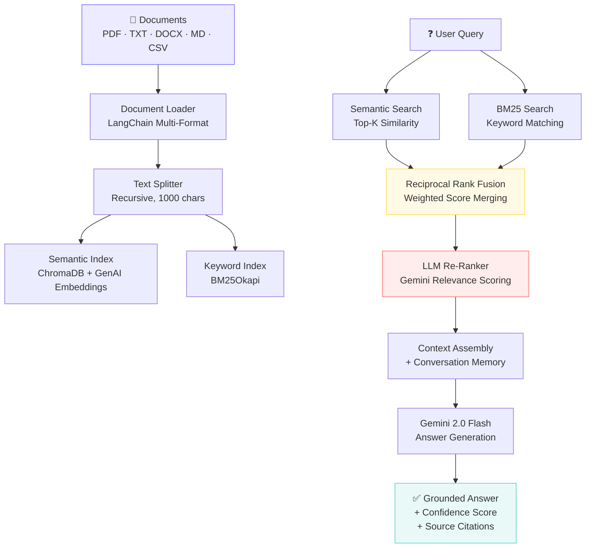

# 🧠 DocQ — Intelligent Document Q&A

[](https://python.org)
[](https://langchain.com)
[](https://cloud.google.com/vertex-ai)
[](https://www.trychroma.com)
[](https://streamlit.io)

## 📖 Introduction

**DocQ** is an enterprise-grade **Retrieval-Augmented Generation (RAG)** pipeline that transforms the way you interact with your documents. Instead of manually searching through pages of PDFs, Word files, Markdown notes, or CSV datasets, you can simply ask a natural language question and receive a precise, source-cited answer in seconds.

Modern organizations generate and store vast amounts of unstructured knowledge — policy documents, technical manuals, research papers, meeting notes, and more. Finding specific information buried inside these documents is often a time-consuming, frustrating process that involves keyword searches, manual skimming, and guesswork. **DocQ eliminates this friction** by indexing your documents into a searchable knowledge base and using Google's **Gemini 2.0 Flash** LLM to generate grounded, contextual answers.

What sets DocQ apart from a naive "embed-and-query" setup is its **hybrid search architecture**. Rather than relying on a single retrieval strategy, DocQ combines **semantic vector search** (via ChromaDB and Google GenAI Embeddings) with **keyword-based BM25 search**, merging results through **Reciprocal Rank Fusion**. The fused results are then **re-ranked by Gemini itself**, ensuring that only the most relevant chunks are used for answer generation. This multi-stage retrieval pipeline dramatically improves answer quality, especially for queries that mix technical jargon with plain-language phrasing.

DocQ also supports **conversation memory**, allowing you to ask follow-up questions that build on previous context — just like chatting with a knowledgeable colleague. Every answer is accompanied by a **confidence score** (HIGH / MEDIUM / LOW) and **source citations**, so you always know how reliable the response is and where to verify it. Whether you prefer a sleek **dark-mode web UI** built with Streamlit or a **rich terminal CLI** with tables and spinners, DocQ delivers a premium experience across both interfaces.

---

## ✨ Features

| Feature | Description |
|---------|-------------|
| 🔮 **Hybrid Search** | Combines semantic (ChromaDB) + keyword (BM25) retrieval via Reciprocal Rank Fusion |
| 📊 **LLM Re-Ranking** | Gemini scores and re-ranks retrieved chunks for maximum relevance |
| 💬 **Conversation Memory** | Follow-up questions with full context from previous turns |
| 🎯 **Confidence Scoring** | Each answer rated HIGH / MEDIUM / LOW with visual badges |
| 📁 **Multi-Format Ingestion** | Supports PDF, TXT, DOCX, Markdown, and CSV files |
| 🔄 **Duplicate Detection** | SHA-256 hashing skips unchanged files on re-ingestion |
| 🎨 **Premium Web UI** | Dark-mode Streamlit interface with glassmorphism design |
| 📈 **Analytics Dashboard** | Track query count, average latency, document stats |
| 🖥️ **Rich CLI** | Beautiful terminal interface with tables, spinners, and color |
| 📝 **Structured Logging** | File-based logging with configurable levels |

---

## 🏗️ Architecture



---

## 🚀 Quick Start

### Prerequisites

- **Python 3.10+**
- **Google Cloud SDK** with Vertex AI API enabled, OR a **Gemini API key**

### Setup

```bash
# Clone the repository
git clone https://github.com/yourusername/document-qa.git
cd document-qa

# Create virtual environment
python -m venv venv
venv\Scripts\activate          # Windows
# source venv/bin/activate     # macOS / Linux

# Install dependencies
pip install -r requirements.txt

# Configure environment
copy .env.example .env         # Windows
# cp .env.example .env         # macOS / Linux
```

### Authentication (choose one)

**Option A — Google Cloud ADC (recommended):**
```bash
gcloud auth application-default login
# Then edit .env → set GOOGLE_CLOUD_PROJECT
```

**Option B — Gemini API Key:**
```bash
# Edit .env → set GOOGLE_API_KEY=your-key-here
```

---

## 💻 Usage

### CLI — Ingest Documents

```bash
# Ingest documents from ./documents (with duplicate detection)
python main.py ingest

# Force re-ingest all files
python main.py ingest --force

# Ingest from a custom directory
python main.py ingest --dir /path/to/docs
```

### CLI — Query Documents

```bash
# Interactive mode (with conversation memory)
python main.py query

# Single question
python main.py query -q "What is the remote work policy?"
```

### CLI — Manage Vector Store

```bash
# View vector store statistics
python main.py stats

# Clear all indexes
python main.py clear
```

### Web UI

```bash
streamlit run app.py
```

---

## 📂 Project Structure

```
document-qa/
├── config.py           # Configuration, constants, and logging setup
├── ingest.py           # Multi-format ingestion with BM25 + ChromaDB
├── rag_chain.py        # Hybrid retrieval, re-ranking, memory, confidence
├── main.py             # CLI entry point with ingest/query/stats/clear
├── app.py              # Premium Streamlit web UI
├── requirements.txt    # Python dependencies
├── .env.example        # Environment variable template
├── documents/          # Place your documents here
├── vectorstore/        # ChromaDB persisted data (auto-generated)
├── bm25_index/         # BM25 keyword index (auto-generated)
└── logs/               # Application logs (auto-generated)
```

---

## ⚙️ Configuration

All settings are configurable via `.env` or `config.py`:

| Variable | Default | Description |
|----------|---------|-------------|
| `GOOGLE_CLOUD_PROJECT` | — | Your GCP project ID |
| `GOOGLE_API_KEY` | — | Alternative: Gemini API key |
| `HYBRID_SEARCH_ALPHA` | `0.7` | Semantic vs keyword weight (0.0–1.0) |
| `MEMORY_WINDOW_SIZE` | `5` | Conversation turns to retain |
| `LOG_LEVEL` | `INFO` | Logging level (DEBUG, INFO, WARNING) |

---


## 🛠️ Tech Stack

- **[LangChain](https://langchain.com)** — Orchestration framework
- **[Google Gemini 2.0 Flash](https://ai.google.dev)** — LLM for answer generation & re-ranking
- **[Google GenAI Embeddings](https://ai.google.dev)** — `text-embedding-004` for semantic search
- **[ChromaDB](https://www.trychroma.com)** — Persisted vector store
- **[BM25Okapi](https://github.com/dorianbrown/rank_bm25)** — Keyword search index
- **[Streamlit](https://streamlit.io)** — Interactive web interface
- **[Rich](https://rich.readthedocs.io)** — Beautiful terminal output

---

## 📄 License

MIT
